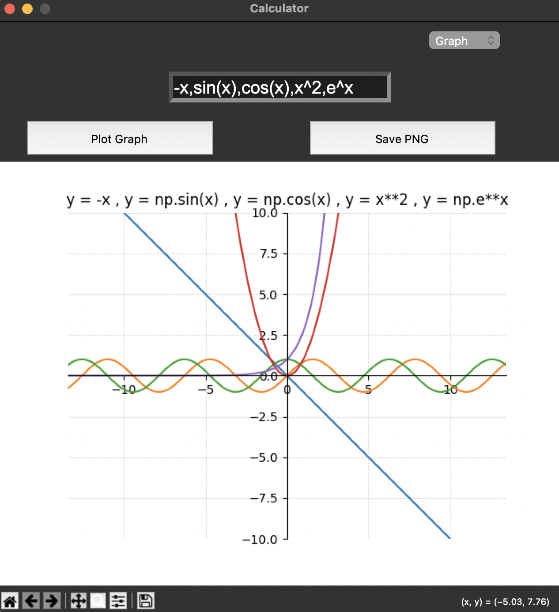

# Graph Calculator

Graph calculator written in Python, using Tkinter, NumPy, Matplotlib. Can be used as a basic calculator and as a graphing calculator.



## Features

- Can do arithmetic operations like addition, subtraction, multiplication, division, exponents
- Can graph one or more functions
- Can graph multiple graphs at once, using a comma-separated list of expressions
- Built in support for sin, cos, tan, log, sqrt, exp, abs, pi, and e
- Save graphs as png files
- Save calculator history as a txt file

## Requirements

- Python
- Tkinter
- NumPy
- Matplotlib
- PyInstaller (for building the app)

On some linux distros, Tkinter may be installed separately:

```bash
sudo apt install python3-tk
```

## Setup and Running

To setup the repo and run the app, run:

```bash
sh setup.sh
```

## Usage

### Calculator Mode

Use the on-screen buttons, or type the calculation directly into the input field. Press Enter or = to calculate.

Examples:

```text
2+3*4
(10-3)/7
```

### Graph Mode

Choose Graph from the dropdown or from the top menu, enter an expression in terms of x, press Plot Graph or Enter.

Examples:

```text
x^2
sin(x)
sqrt(abs(x))
```

Multiple expressions are also supported and entered separated by a coma `,`, like:

```text
x^4, sin(x), cos(x), sqrt(abs(x)),e^x
```

Graph mode also support `^` as exponentiation notation instead of Python's `**`.

## Saving Files

- `File > Save History` to save the calculator history as a `.txt` file at a specified file location.
- `Save PNG` or `File > Save Graph` to save the graph as a `.png` file at a specified file location.

## Build

To create a desktop build, run:

```bash
sh build.sh
```

The generated app files will be placed in PyInstaller's output folders, usually `dist/`.

## Project Structure

```text
.
├── build.sh
├── images
│   └── graph_eg.png
├── README.md
├── requirements.txt
├── setup.sh
└── src
    └── main.py
```
